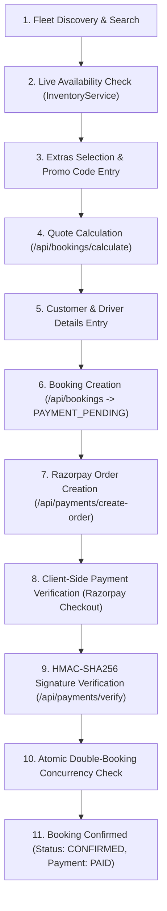

# NR Car Hire Information

## Company Overview

**NR Car Hire** is a premier Australian car rental service providing reliable passenger vehicle hire across major Australian airports and metropolitan hubs. The company operates on three core principles:
1. **Premium & Reliable Fleet**: Late-model, well-maintained vehicles ranging from fuel-efficient sedans and family hybrid SUVs to heavy-duty 4x4 dual-cab utilities and German executive luxury cars.
2. **Transparent Pricing**: Clear daily rental rates inclusive of Australian Goods and Services Tax (GST) with no hidden distance charges or unexpected surcharges.
3. **Seamless Digital Experience**: Real-time authoritative vehicle availability, instant quote calculation, secure online booking, Razorpay test-mode payment gateway integration, and the AI-powered NR Concierge voice assistant.

### Key Value Propositions
- **Unlimited Kilometres**: Included on all standard passenger rentals across Australia.
- **Full-to-Full Fuel Policy**: Vehicles are provided with a full tank of fuel and returned full.
- **24/7 Roadside Assistance**: National breakdown support included on every rental.
- **Flexible Airport Hub Access**: On-site airport desks, pedestrian skywalk access, and 24/7 secure key return drop boxes.

---

## Services

NR Car Hire provides four primary service tiers alongside specialized rental options:

### 1. Primary Service Offerings
- **Short-Term Rental (`svc-short`)**: Daily and weekly vehicle hire with flexible pickup and return options across all Australian hub locations.
- **Long-Term Rental (`svc-long`)**: Monthly and extended hire plans with competitive daily rates for longer journeys and corporate relocations.
- **Airport Transfers (`svc-airport`)**: Convenient vehicle collection and drop-off directly at major Australian domestic and international airport terminals.
- **Corporate Hire (`svc-corporate`)**: Dedicated fleet solutions and managed business accounts for corporate travel.

### 2. Specialized Rental Options
- **One-Way Interstate Hire**: Supported between any official hub locations (e.g., collect in Sydney and return in Melbourne or Brisbane). Route relocation charges may apply based on fleet balance.
- **24/7 Mechanical Breakdown Support**: Complimentary nationwide roadside assistance for mechanical failures.
- **Zero Excess Damage Protection**: Optional damage waiver reducing accidental damage liability from the standard $2,500 to $0.
- **Child Safety Seats**: Australian Standard AS/NZS 1754 certified baby capsules, toddler seats, and booster seats.
- **Satellite GPS Navigation**: Dedicated portable turn-by-turn units with live traffic re-routing and speed camera alerts.

---

## Fleet Details

The NR Car Hire fleet consists of 6 core production vehicles across 4 distinct categories. All vehicles are 2024 models equipped with standard air conditioning, Bluetooth connectivity, built-in navigation, cruise control, and reversing cameras.

| Vehicle ID | Year | Make | Model | Category | Daily Rate | Seats | Doors | Transmission | Fuel Type | Luggage Capacity | Primary Location | Key Features & Notes |
| :--- | :--- | :--- | :--- | :--- | :--- | :--- | :--- | :--- | :--- | :--- | :--- | :--- |
| `v-001-camry` | 2024 | Toyota | Camry | Sedan | ₹89/day | 5 | 4 | Automatic | Petrol | 3 bags | Sydney | Best-value executive sedan; 524L boot; smooth cruising; high fuel efficiency. |
| `v-002-cx5` | 2024 | Mazda | CX-5 | SUV | ₹109/day | 5 | 5 | Automatic | Petrol | 4 bags | Melbourne | Refined mid-size SUV; Japanese craftsmanship; elevated ride height; versatile cargo. |
| `v-003-3series` | 2024 | BMW | 3 Series | Premium | ₹179/day | 5 | 4 | Automatic | Petrol | 3 bags | Sydney | Sports luxury sedan; dynamic rear-wheel performance; bespoke leather interior. |
| `v-004-hilux` | 2024 | Toyota | HiLux | Utility | ₹129/day | 5 | 4 | Manual | Diesel | 2 bags | Brisbane | Heavy-duty dual-cab 4x4 ute; turbo diesel; rugged touring and cargo utility. *(Note: Scheduled maintenance holds apply periodically).* |
| `v-005-cclass` | 2024 | Mercedes-Benz | C-Class | Luxury | ₹199/day | 5 | 4 | Automatic | Petrol | 3 bags | Perth | Prestige executive touring; whisper-quiet cabin; ambient lighting; supreme ride comfort. |
| `v-006-tucson` | 2024 | Hyundai | Tucson | SUV | ₹99/day | 5 | 5 | Automatic | Hybrid | 4 bags | Gold Coast | Compact hybrid crossover; high fuel efficiency; 539L boot; spacious family cabin. *(Note: Scheduled maintenance holds apply periodically).* |

### Grounded Vehicle Comparisons
- **Toyota Camry vs. Hyundai Tucson**: The Camry (Sedan, ₹89/day) offers lower daily rates and excellent highway fuel efficiency. The Tucson (SUV Hybrid, ₹99/day) provides higher ground clearance, 539L boot space, and greater family cargo flexibility.
- **Mazda CX-5 vs. Hyundai Tucson**: The CX-5 (₹109/day) delivers sporty handling and premium cabin finishes, while the Tucson (₹99/day) is more budget-friendly for families and operates on a hybrid powertrain.
- **BMW 3 Series vs. Mercedes-Benz C-Class**: Both are German executive sedans. The BMW 3 Series (₹179/day) emphasizes sporty rear-wheel-drive dynamics and digital cockpit tech; the Mercedes-Benz C-Class (₹199/day) emphasizes ultra-luxurious cabin acoustics and serene comfort.

---

## Pricing

### 1. Base Daily Rental Rates
- **Toyota Camry**: ₹89 / day
- **Hyundai Tucson**: ₹99 / day
- **Mazda CX-5**: ₹109 / day
- **Toyota HiLux**: ₹129 / day
- **BMW 3 Series**: ₹179 / day
- **Mercedes-Benz C-Class**: ₹199 / day

*Note on Currency*: All prices are currently configured and processed in **Indian Rupees (₹ / INR)** during active platform testing, inclusive of Australian GST.

### 2. Optional Extras Catalog
| Extra ID | Code | Name | Description | Pricing Type | Price | Max Quantity | Recommended For |
| :--- | :--- | :--- | :--- | :--- | :--- | :--- | :--- |
| `ext-zero-excess` | `ZERO_EXCESS` | Zero Excess Premium Protection | Comprehensive damage waiver reducing accidental liability to $0 | Per Day | ₹25 / day | 1 | Complete peace of mind; covers windscreens, tyres, single-vehicle incidents |
| `ext-add-driver` | `ADD_DRIVER` | Additional Authorised Driver | Allows a second eligible licensed driver to operate the vehicle | Flat Fee | ₹15 flat | 2 | Shared long-distance driving |
| `ext-child-seat` | `CHILD_SEAT` | Child Safety Baby / Booster Seat | AS/NZS 1754 approved rear/forward facing safety seat or booster | Per Day | ₹12 / day | 2 | Family trips with infants or young children |
| `ext-gps` | `GPS_NAV` | GPS Satellite Navigation Unit | Portable GPS unit with live traffic and speed camera warnings | Per Day | ₹10 / day | 1 | Highway navigation & regional road trips |
| `ext-roadside-plus` | `ROADSIDE_PLUS` | 24/7 Roadside Assistance Plus | Covers key lockouts, lost keys, flat tyres, jump-starts, and emergency towing | Per Day | ₹8 / day | 1 | Breakdown protection against driver-fault incidents |

### 3. Active Promotional Discounts
| Promo Code | Discount Type | Value | Min Rental Days | Min Booking Value | Applicable Categories | Limits | Description |
| :--- | :--- | :--- | :--- | :--- | :--- | :--- | :--- |
| `SAVE10` | Percentage | 10% | 2 days | None | All fleet | Max discount ₹100; 2 uses/customer | 10% discount on all Australian rentals |
| `WEEKEND50` | Fixed Amount | ₹50 | 3 days | ₹200 | All fleet | 1 use/customer | ₹50 flat discount for bookings over 3 days |
| `SUMMER15` | Percentage | 15% | 4 days | None | Premium, Luxury, SUV | 1 use/customer | 15% summer holiday discount on Premium, Luxury, and SUVs |

### 4. Security Deposit & Bond Pre-Authorisation
- **Standard Sedans & SUVs**: $200 pre-authorisation hold placed on the customer's payment card at vehicle pickup.
- **Luxury & Utility (4x4) Vehicles**: $500 pre-authorisation hold placed on the customer's payment card at vehicle pickup.
- **Release Timeline**: Automatically released within 3 to 5 business days after returning the vehicle in good condition without damages or toll infractions.

### 5. Late Return & Grace Period
- **Grace Period**: Complimentary 59-minute grace period on all returns.
- **Late Fee**: Returns delayed past 1 hour are charged at $20/hour up to a maximum of 1 full day rental rate.

---

## Booking Process

The NR Car Hire platform implements an end-to-end customer journey with strict server-side validation and concurrency controls:



### Detailed Booking Steps
1. **Fleet Discovery & Search**: The customer selects travel dates, pickup location, drop-off location, and preferred vehicle category on the homepage or `/fleet`.
2. **Live Availability Check**: The system queries `InventoryService.checkAvailability()` to ensure the selected vehicle is not booked, blocked by maintenance, or deactivated.
3. **Extras & Promotion Selection**: The customer customizes their rental with optional extras (Zero Excess, Child Seats, GPS, Roadside Plus, Additional Driver) and applies any valid promo code (`SAVE10`, `WEEKEND50`, `SUMMER15`).
4. **Authoritative Quote Calculation**: The backend calculates:
   $$\text{Base Amount} = \text{Rental Days} \times \text{Daily Rate}$$
   $$\text{Final Amount} = \text{Base Amount} + \text{Extras Total} - \text{Discount Total} + \text{Tax (GST included)}$$
5. **Driver Details Submission**: The customer enters mandatory contact and driver licensing details.
6. **Booking Draft Creation**: The server creates a booking record in `PAYMENT_PENDING` status with an assigned booking reference (e.g., `NR-2026-XXXXX`).
7. **Payment Processing**: A Razorpay order is initialized. The customer completes test payment in INR.
8. **Cryptographic Verification**: The backend verifies the Razorpay signature using HMAC-SHA256 with the server-side webhook/key secret.
9. **Atomic Lock & Confirmation**: An atomic concurrency check guarantees the vehicle has not been concurrently reserved. Upon success, the booking is updated to `CONFIRMED` status, payment is set to `PAID`, promo code usage is incremented, and an audit log is created.

---

## Customer Information Required

To finalize a booking reservation, the customer must provide the following information:

### 1. Mandatory Fields
- **First Name** (`firstName`): 1 to 50 characters.
- **Last Name** (`lastName`): 1 to 50 characters.
- **Email Address** (`email`): Valid email format for confirmation delivery and account association.
- **Phone Number** (`phone`): 8 to 20 characters, including country/area code.
- **Driver Licence Number** (`licenseNumber`): 4 to 50 characters.

### 2. Optional Fields
- **Date of Birth** (`dateOfBirth`): YYYY-MM-DD string.
- **Licence Issuing State / Country** (`licenseState`): e.g., NSW, VIC, QLD, WA, SA, or Overseas.
- **Residential Address** (`address`): Street address (up to 200 characters).
- **City** (`city`): Residential city (up to 100 characters).
- **State** (`state`): Residential state (up to 50 characters).
- **Postal Code** (`postalCode`): Postal/ZIP code (up to 20 characters).

### 3. Driver Eligibility & Rules
- **Minimum Age**: 21 years old.
  - *Drivers aged 21–24*: Eligible for Sedans and Compact SUVs (subject to a standard young driver surcharge of $15/day).
  - *Drivers aged 25+*: Full access to all fleet categories (Sedans, SUVs, Premium, Luxury, Utilities) with no young driver surcharge.
- **Licence Validity**:
  - Full, valid physical driver licence held for at least 12 continuous months.
  - Accepted licences: All Australian state/territory physical and digital licences, New Zealand licences, and English-language overseas licences.
  - Non-English overseas licences require an official International Driving Permit (IDP) or NAATI-certified English translation alongside the original physical licence and passport.
  - Learner permits, provisional learner licences, and suspended licences are strictly prohibited.

---

## Locations Served & Airport Hubs

NR Car Hire operates across 6 primary airport hubs and metropolitan locations in Australia:

| Location ID | Code | Hub Name | Airport / City | State | Terminal & Desk Details | Operating Hours | After-Hours Return |
| :--- | :--- | :--- | :--- | :--- | :--- | :--- | :--- |
| `loc-syd-airport` | `SYD_APT` | Sydney Airport Hub (SYD) | Mascot, Sydney | NSW | Terminal 1 (International) & Terminal 2/3 (Domestic); Arrivals Hall opposite Carousel 3 | 05:30 AM – 11:30 PM (7 days) | 24/7 Key Drop Box at T1 & T2 car park |
| `loc-syd-cbd` | `SYD_CBD` | Sydney CBD — Central Station | Surry Hills, Sydney | NSW | 200 Elizabeth Street, Surry Hills NSW 2010 | 08:00 AM – 06:00 PM (Mon–Sat) | Key drop box at reception desk |
| `loc-mel-airport` | `MEL_APT` | Melbourne Tullamarine (MEL) | Melbourne Airport | VIC | Ground Floor, Terminal 2 International Arrivals concourse; 2 min walk from baggage | 06:00 AM – 11:00 PM (7 days) | 24/7 Key Drop Box next to return booth |
| `loc-bne-airport` | `BNE_APT` | Brisbane Airport (BNE) | Brisbane Airport | QLD | Level 1 Domestic Terminal concourse; covered pedestrian skywalk to bays | 06:00 AM – 11:00 PM (7 days) | 24/7 Key Return slot at drop-off lane |
| `loc-per-airport` | `PER_APT` | Perth International (PER) | Redcliffe, Perth | WA | Ground Floor Arrivals Hall in Terminal 1 and Terminal 4; bays directly outside | 06:00 AM – Midnight (7 days) | 24/7 Key Drop Box at car park exit boom-gate |
| `loc-ool-airport` | `OOL_APT` | Gold Coast Airport (OOL) | Bilinga, Coolangatta | QLD | Main Terminal opposite Baggage Reclaim; direct 150m walking access | 06:30 AM – 10:00 PM (7 days) | Key drop box at main customer counter |
| `loc-adl` | `ADL` | Adelaide Airport (ADL) | Adelaide | SA | Ground Floor adjacent to baggage carousels; multi-level car park on Ground Level | 06:00 AM – 11:00 PM (7 days) | 24/7 Drop Box on Ground Floor car park desk |

---

## Cancellation Policy

1. **Free Cancellation (100% Refund)**:
   - Cancellations made **up to 48 hours** prior to the scheduled pickup date and time receive a full 100% refund processed back to the original payment method.
2. **Late Cancellation (Within 48 Hours)**:
   - Cancellations made **within 48 hours** of scheduled pickup receive a 50% cash refund or a 100% non-expiring credit voucher for future rentals.
3. **No-Show Policy**:
   - Failure to collect the vehicle without prior notice results in forfeiture of the rental fee (non-refundable).
4. **Booking Modifications**:
   - Date, time, vehicle, or location changes can be made free of administrative fees up to **24 hours** prior to pickup. Rate adjustments apply if new dates or vehicles have different daily pricing.
5. **Self-Service Customer Cancellation**:
   - Authenticated customers can cancel their own bookings via the customer portal (`/account`) or via `POST /api/bookings/[bookingId]/cancel` with an enforced Insecure Direct Object Reference (IDOR) ownership check.
6. **Administrative Cancellation & Gateway Refund**:
   - NR Car Hire staff can cancel bookings and trigger payment gateway refunds via `POST /api/payments/[paymentId]/refund`.

---

## FAQs

### 1. General & Fleet
- **Q: Are all vehicles automatic?**
  - **A**: Almost all vehicles (Camry, CX-5, BMW 3 Series, Mercedes C-Class, Tucson) are Automatic. The Toyota HiLux (`v-004-hilux`) is a Manual transmission 4x4. If a customer requests a "manual SUV", explain that all SUVs in the fleet are automatic and recommend the closest available automatic SUV.
- **Q: Do you have 7-seater or 8-seater vans?**
  - **A**: Not available in codebase. Our fleet currently features 5-passenger sedans, SUVs, and 4x4 utilities.
- **Q: Are child seats available?**
  - **A**: Yes. Australian Standard AS/NZS 1754 approved rear-facing capsules, forward-facing child seats, and booster seats are available for ₹12/day.

### 2. Driving & Requirements
- **Q: Can I drive with an overseas licence?**
  - **A**: Yes, provided it is a full, valid English-language physical licence held for over 12 months. If your licence is not in English, an official International Driving Permit (IDP) or NAATI translation must accompany the original licence and your passport.
- **Q: Is there an extra fee for young drivers?**
  - **A**: Drivers aged 21–24 can rent Sedans and Compact SUVs with a $15/day young driver surcharge. Drivers 25 and over have standard access to all cars without surcharge.

### 3. Trips & Mileage
- **Q: Are kilometres capped?**
  - **A**: No. All standard passenger rentals come with 100% unlimited kilometres throughout Australia.
- **Q: Can I pick up in Sydney and drop off in Melbourne or Brisbane?**
  - **A**: Yes. One-way rentals are supported across all official hub locations.
- **Q: What is the fuel policy?**
  - **A**: We operate on a Full-to-Full fuel policy. The car is supplied full and must be returned full.

### 4. Insurance, Bond & Assistance
- **Q: Is insurance included?**
  - **A**: Standard Comprehensive Insurance with a $2,500 damage liability excess is included in every booking. Zero Excess Protection can be added for ₹25/day to reduce damage liability to $0.
- **Q: What is the security deposit?**
  - **A**: A pre-authorisation hold of $200 for standard vehicles or $500 for luxury/utility vehicles is placed on your card at pickup and released within 3–5 business days after return.
- **Q: What if I break down or get a flat tyre?**
  - **A**: Standard 24/7 mechanical breakdown assistance is included for free. Optional Roadside Assistance Plus (₹8/day) covers non-mechanical driver faults including lost keys, key lockouts, flat tyres, jump-starts, and emergency fuel delivery.

---

## AI Agent Rules

When acting as the **NR Concierge** AI voice/chat agent, you must strictly follow these operational and behavioral rules:

### 1. Single Voice Pipeline & English Output
- **Language**: Respond **ONLY in clean, fluent, natural conversational English**.
- **Multilingual Input Handling**: Understand Hinglish, Hindi, colloquial phrases, slang, and spelling errors seamlessly, but **ALWAYS reply in 100% natural English**. Never generate Hindi, Gujarati, or mixed-language output.
- **Voice Provider**: ElevenLabs TTS via `/api/tts` using `ELEVENLABS_VOICE_ID` is the single source of truth. Accidental fallback to browser synthetic voices is disabled.

### 2. Vehicle Truth & Anti-Hallucination Guardrails
- **Zero Fabrication**: Never invent vehicles that do not exist in the NR Car Hire fleet (e.g., Tesla, Audi, BMW X7, 7-seater vans).
- **Attribute Truth**: Never claim an automatic car is manual or vice versa.
- **Vehicle Not in Fleet Phrasing**: If a customer requests a car not in the fleet, say:
  > *"I couldn't find that vehicle in our NR Car Hire fleet. Want me to show you some similar options?"* and recommend real fleet alternatives.

### 3. Authoritative Availability & Maintenance Rules
- **Live Inventory Grounding**: Availability must be checked authoritatively against `InventoryService`. Never fabricate availability.
- **Maintenance Block Phrasing**: When a vehicle is unavailable due to maintenance (e.g., HiLux or Tucson on September 1–5), you MUST clearly explain:
  > *"The [Vehicle Name] is unavailable from [Pickup] to [Dropoff] because it is scheduled for maintenance. Would you like me to check different dates or show similar available vehicles?"*
- **Forbidden Phrases on Unavailable Vehicles**: Never say "proceed with other date", "book another date", "available", or initiate a checkout flow for blocked dates.
- **Multi-turn Follow-Up Flow**:
  - When the customer says *"show similar"* or *"similar vehicles"*: Retain the requested dates and category from context, query `InventoryService` for candidate alternatives, and return available vehicles with pre-filled booking URLs.
  - When the customer says *"check different dates"*: Prompt the customer: *"What new travel dates would you like to check for the [Vehicle Name]?"*.

### 4. Read-Only Security & Secret Redaction
- **No Direct Mutation**: The AI Agent is strictly read-only and cannot alter prices, delete bookings, create maintenance holds, or modify database entries.
- **Redaction of Secrets**: Never print, log, or expose internal database IDs (e.g., `m-seed-001-hilux`, `v-001-camry`), admin overhaul codes, Razorpay secrets, or ElevenLabs API keys.

### 5. Speech Optimization for ElevenLabs TTS
- **Strip Markdown**: Remove asterisks (`**`), backticks (```), hashtags (`###`), and raw markdown formatting.
- **Natural Price & Date Conversion**:
  - Convert `₹89/day` $\rightarrow$ *"89 rupees per day"*.
  - Convert `2026-09-01 to 2026-09-05` $\rightarrow$ *"September 1st to September 5th"*.
- **Strip URLs from Spoken Audio**: Remove raw links like `/book/v-001-camry` from the text before sending to ElevenLabs TTS; present links visually in the UI cards only.

---

## Available Backend Actions/APIs

The following backend endpoints and services are implemented in the NR Car Hire codebase for AI agent integration:

### 1. Check Vehicle Availability
- **Route**: `GET /api/vehicles/[vehicleId]/availability`
- **Query Parameters**:
  - `pickupDate`: String (ISO date `YYYY-MM-DD`, required)
  - `dropoffDate`: String (ISO date `YYYY-MM-DD`, required)
- **Service Method**: `inventoryService.checkAvailability(vehicleId, pickupDate, dropoffDate)`
- **Response Format**:
  ```json
  {
    "success": true,
    "data": {
      "isAvailable": false,
      "reason": "Vehicle has scheduled maintenance: transmission rebuild and mechanical inspection",
      "vehicleId": "v-004-hilux",
      "pickupDate": "2026-09-01T00:00:00.000Z",
      "dropoffDate": "2026-09-05T00:00:00.000Z",
      "totalDays": 4,
      "dailyRate": 129,
      "estimatedTotal": 516
    }
  }
  ```

### 2. Search & List Fleet Vehicles
- **Route**: `GET /api/vehicles`
- **Query Parameters**:
  - `category`: String (`Sedan`, `SUV`, `Premium`, `Luxury`, `Utility`, optional)
  - `location`: String (`Sydney`, `Melbourne`, `Brisbane`, `Perth`, `Gold Coast`, optional)
  - `transmission`: String (`Automatic`, `Manual`, optional)
  - `minSeats`: Number (optional)
  - `maxPrice`: Number (optional)
  - `search`: String (keyword search across make, model, category, optional)
- **Service Method**: `vehicleStore.list(params)`
- **Response Format**:
  ```json
  {
    "success": true,
    "data": [
      {
        "id": "v-001-camry",
        "make": "Toyota",
        "model": "Camry",
        "year": 2024,
        "category": "Sedan",
        "dailyRate": 89,
        "seats": 5,
        "transmission": "Automatic",
        "fuelType": "Petrol",
        "location": "Sydney",
        "imageUrl": "/images/vehicles/toyota-camry.jpg"
      }
    ],
    "pagination": { "page": 1, "limit": 20, "total": 6, "totalPages": 1 }
  }
  ```

### 3. Calculate Rental Price & Quote
- **Route**: `POST /api/bookings/calculate`
- **Request Body**:
  ```json
  {
    "vehicleId": "v-001-camry",
    "pickupLocation": "Sydney",
    "dropoffLocation": "Sydney",
    "pickupDate": "2026-09-10T10:00:00.000Z",
    "dropoffDate": "2026-09-14T10:00:00.000Z",
    "selectedExtras": [
      { "extraId": "ext-zero-excess", "quantity": 1 }
    ],
    "promoCode": "SAVE10"
  }
  ```
- **Service Method**: `bookingService.calculateQuote(input)`
- **Response Format**:
  ```json
  {
    "success": true,
    "data": {
      "rentalDays": 4,
      "dailyRate": 89,
      "baseAmount": 356,
      "extrasAmount": 100,
      "discountAmount": 35.6,
      "taxAmount": 0,
      "finalAmount": 420.4,
      "currency": "INR",
      "promoApplied": { "code": "SAVE10", "discountType": "PERCENTAGE", "value": 10, "discountAmount": 35.6 }
    }
  }
  ```

### 4. Validate Promotional Discount
- **Route**: `POST /api/discounts/validate`
- **Request Body**:
  ```json
  {
    "code": "SAVE10",
    "vehicleId": "v-001-camry",
    "category": "Sedan",
    "rentalDays": 4,
    "baseAmount": 356,
    "customerId": "cust-123"
  }
  ```
- **Service Method**: `discountService.validatePromo(input)`
- **Response Format**:
  ```json
  {
    "success": true,
    "data": {
      "isValid": true,
      "code": "SAVE10",
      "discountType": "PERCENTAGE",
      "value": 10,
      "discountAmount": 35.6
    }
  }
  ```

### 5. Create Booking Draft & Initialize Razorpay Order
- **Route**: `POST /api/bookings`
- **Request Body**:
  ```json
  {
    "vehicleId": "v-001-camry",
    "pickupLocation": "Sydney",
    "dropoffLocation": "Sydney",
    "pickupDate": "2026-09-10T10:00:00.000Z",
    "dropoffDate": "2026-09-14T10:00:00.000Z",
    "customer": {
      "firstName": "John",
      "lastName": "Smith",
      "email": "john.smith@example.com",
      "phone": "+61412345678",
      "licenseNumber": "DL-99887766",
      "licenseState": "NSW"
    },
    "selectedExtras": [{ "extraId": "ext-zero-excess", "quantity": 1 }],
    "promoCode": "SAVE10",
    "currency": "INR"
  }
  ```
- **Service Method**: `bookingService.createBooking(input)`
- **Response Format**:
  ```json
  {
    "success": true,
    "data": {
      "booking": {
        "id": "bk-1787431284478-fp545",
        "bookingNumber": "NR-2026-35758",
        "status": "PAYMENT_PENDING",
        "finalAmount": 420.4
      },
      "paymentOrder": {
        "orderId": "order_1787431284478_y8bpgr9",
        "amount": 42040,
        "amountMajor": 420.4,
        "currency": "INR",
        "keyId": "rzp_test_placeholder"
      }
    }
  }
  ```

### 6. Verify Payment & Confirm Booking
- **Route**: `POST /api/payments/verify`
- **Request Body**:
  ```json
  {
    "razorpayOrderId": "order_1787431284478_y8bpgr9",
    "razorpayPaymentId": "pay_test_genuine_123",
    "razorpaySignature": "2a0139bc..."
  }
  ```
- **Service Method**: `paymentService.verifyPaymentSignature(input)` $\rightarrow$ `bookingService.confirmBookingPayment(...)`
- **Response Format**:
  ```json
  {
    "success": true,
    "data": {
      "bookingId": "bk-1787431284478-fp545",
      "bookingNumber": "NR-2026-35758",
      "status": "CONFIRMED",
      "paymentStatus": "PAID",
      "razorpayPaymentId": "pay_test_genuine_123"
    }
  }
  ```

### 7. Lookup Booking Details
- **Route**: `GET /api/bookings/[bookingId]`
- **Parameters**: `bookingId` (Internal ID or `bookingNumber` like `NR-2026-35758`)
- **Access Control**: Enforces IDOR check (Customers can only view their own bookings; Admins can view all).
- **Service Method**: `bookingService.getBookingById(bookingId, userContext)`

### 8. Cancel Booking
- **Route**: `POST /api/bookings/[bookingId]/cancel`
- **Request Body**:
  ```json
  {
    "reason": "Flight cancelled by airline"
  }
  ```
- **Service Method**: `bookingService.cancelBooking(bookingId, input, userContext)`
- **Response Format**:
  ```json
  {
    "success": true,
    "data": {
      "id": "bk-1787431284478-fp545",
      "bookingNumber": "NR-2026-35758",
      "status": "CANCELLED",
      "cancellationReason": "Flight cancelled by airline"
    }
  }
  ```

### 9. Text-to-Speech Audio Generation (ElevenLabs)
- **Route**: `POST /api/tts`
- **Request Body**:
  ```json
  {
    "text": "Yes, the 2024 Toyota Camry is available from September 10th to September 14th for 89 rupees per day."
  }
  ```
- **Response**: Streamed binary `audio/mpeg` content for browser playback.
- **Provider**: Server-side ElevenLabs TTS (`eleven_turbo_v2_5` or `eleven_multilingual_v2` with `ELEVENLABS_VOICE_ID`).
